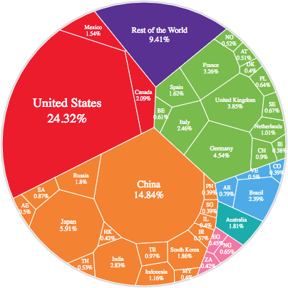

# d3-voronoi-treemap
This D3 plugin produces a *Voronoï treemap*. Given a convex polygon and nested weighted data, it tesselates/partitions the polygon in several inner cells which represent the hierarchical structure of your data, such that the area of a cell represents the weight of the underlying datum.

Because a picture is worth a thousand words:



Available only for **d3 v4**.

If you're interested on one-level map, take a look at the [d3-voronoi-map](https://github.com/Kcnarf/d3-voronoi-map) plugin, which may be simpler to use (no need of a d3-hierarchy).

## Context
D3 already provides a [d3-treemap](https://github.com/d3/d3-hierarchy/blob/master/README.md#treemap) module which produces a rectangular treemap. Such treemaps could be distorted to fit shapes that are not rectangles (cf. [Distorded Treemap - d3-shaped treemap](http://bl.ocks.org/Kcnarf/976b2e854965eea17a7754517043b91f)).

This plugin allows to compute a treemap with a unique look-and-feel, where inner areas are not strictly aligned each others, and where the outer shape can be any hole-free convex polygons (squares, rectangles, pentagon, hexagon, ... any regular convex polygon, and also any non regular hole-free convex polygon).

The drawback is that the computation of a Voronoï treemap is based on a iteration/looping process. Hence, it requires *some times*, depending on the number and type of data/weights, the desired representativeness of cell areas.

## Examples
* still to come ...

## Installing
If you use NPM, ```npm install d3-voronoi-treemap```. Otherwise, load ```https://rawgit.com/Kcnarf/d3-voronoi-treemap/master/build/d3-voronoi-treemap.js``` (or its ```d3-voronoi-treemap.min.js``` version) to make it available in AMD, CommonJS, or vanilla environments. In vanilla, you must load the [d3-weighted-voronoi](https://github.com/Kcnarf/d3-weighted-voronoi) and [d3-voronoi-map](https://github.com/Kcnarf/d3-voronoi-map) plugins prioir to this one, and a d3 global is exported:
```html
<script src="https://d3js.org/d3.v4.min.js"></script>
<script src="https://raw.githack.com/Kcnarf/d3-weighted-voronoi/master/build/d3-weighted-voronoi.js"></script>
<script src="https://raw.githack.com/Kcnarf/d3-voronoi-map/master/build/d3-voronoi-map.js"></script>
<script src="https://raw.githack.com/Kcnarf/d3-voronoi-treemap/master/build/d3-voronoi-treemap.js"></script>
<script>
  var voronoiTreemap = d3.voronoiTreemap();
</script>
```

## TL;DR;
In your javascript, in order to define the tessellation:
```javascript
var rootNode = d3.hierarchy(nestedData);                // a d3-hierarchy of your nested data
rootNode.sum(function(d){ return weightAccessor(d); }); // assigns the adequate weight to each node of the d3-hierarchy

var voronoiTreemap = d3.voronoiTreemap()
  .clip([0,0], [0,height], [width, height], [width,0]); // sets the clipping polygon
voronoiTreemap(rootNode.sum());                         // computes the weighted Voronoi tessellation of the d3-hierarchy; assigns a 'polygon' property to each node of the hierarchy
  
```

Then, later in your javascript, in order to draw cells:
```javascript
var allNodes = rootNode.descendants;
d3.selectAll('path')
  .data(allNodes)
  .enter()
    .append('path')
      .attr('d', function(d){ return cellLiner(d.polygon)+"z"; })
      .style('fill', function(d){ return fillScale(d.data); })  // d is a node, d.data is your original data
```

## Reference
* based on [Computing Voronoï Treemaps - Faster, Simpler, and Resolution-independent ](https://www.uni-konstanz.de/mmsp/pubsys/publishedFiles/NoBr12a.pdf)
* [https://github.com/ArlindNocaj/power-voronoi-diagram](https://github.com/ArlindNocaj/power-voronoi-diagram) for a Java implementation

## API
<a name="voronoiTreemap" href="#voronoiTreemap">#</a> d3.<b>voronoiTreemap</b>()

Creates a new voronoiTreemap with the default [*clip*](#voronoiTreemap_clip), [*convergenceRatio*](#voronoiTreemap_convergenceRatio), [*maxIterationCount*](#voronoiTreemap_maxIterationCount) and [*minWeightRatio*](#voronoiTreemap_minWeightRatio) configuration values.

<a name="_voronoiTreemap" href="#_voronoiTreemap">#</a> <i>voronoiTreemap</i>(<i>root</i>)

Computes the **Voronoï treemap** for the specified [d3-hierarchy](https://github.com/d3/d3-hierarchy#hierarchy), where *root* is the root node of the hierarchy, assigning a *polygon* property on the root and its descendants. A polygon is represented as an array of points \[*x*, *y*\] where *x* and *y* are the point coordinates, a *site* field that refers to its site (ie. with x, y and weight retrieved from the original data), and a *site.originalObject* field that refers to the corresponding element in *data*. Polygons are open: they do not contain a closing point that duplicates the first point; a triangle, for example, is an array of three points. Polygons are also counterclockwise (assuming the origin ⟨0,0⟩ is in the top-left corner).

As others d3-hierarchy layouts (rectangular treemap, or circle packing), the Voronoï treemap layout considers the weight of a node to be the *value* propertyof that node. Hence, you **must** call [root.sum](https://github.com/d3/d3-hierarchy#node_sum) before passing the hierarchy to the Voronoï treemap layout, in order to properly set the _value_ property of each node (root, intermediates and leaves). For example, considering that your original nested data have leaves with a *weight* property, you must use ```rootNode.sum(function(d){ return d.weight; })```.

<a name="voronoiTreemap_clip" href="#voronoiTreemap_clip">#</a> <i>voronoiTreemap</i>.<b>clip</b>([<i>clip</i>])

If *clip* is specified, sets the clipping polygon. *clip* defines a hole-free convex polygon, and is specified as an array of 2D points \[x, y\], which must be *(i)* open (no duplication of the first D2 point) and *(ii)* counterclockwise (assuming the origin ⟨0,0⟩ is in the top-left corner). If *clip* is not specified, returns the current clipping polygon, which defaults to:

```js
[[0,0], [0,1], [1,1], [1,0]]
```

<a name="voronoiTreemap_convergenceRatio" href="#voronoiTreemap_convergenceRatio">#</a> <i>voronoiTreemap</i>.<b>convergenceRatio</b>([<i>convergenceRatio</i>])

If *convergenceRatio* is specified, sets the convergence ratio, which stops computation when (cell area errors / ([*clip*](#voronoiTreemap_clip)-ping polygon area) <= *convergenceRatio*. If *convergenceRatio* is not specified, returns the current *convergenceRatio* , which defaults to:

```js
var convergenceRation = 0.01  // stops computation when cell area error <= 1% clipping polygon's area
```

The smaller the *convergenceRatio*, the more representative is the treemap, the longer the computation takes time. 

<a name="voronoiTreemap_maxIterationCount" href="#voronoiTreemap_maxIterationCount">#</a> <i>voronoiTreemap</i>.<b>maxIterationCount</b>([<i>maxIterationCount</i>])

If *maxIterationCount* is specified, sets the maximum allowed number of iterations, which stops computation when it is reached, even if the [*convergenceRatio*](#voronoiTreemap_convergenceRatio) is not reached. If *maxIterationCount* is not specified, returns the current *maxIterationCount* , which defaults to:

```js
var maxIterationCount = 50;
```

If you want to wait until computation stops _only_ when the [*convergenceRatio*](#voronoiTreemap_convergenceRatio) is reached, just set the *maxIterationCount* to a large amount. Be warned that computation may take a huge amount of time, due to flickering behaviours in later iterations.

<a name="voronoiTreemap_minWeightRatio" href="#voronoiTreemap_minWeightRatio">#</a> <i>voronoiTreemap</i>.<b>minWeightRatio</b>([<i>minWeightRatio</i>])

If *minWeightRatio* is specified, sets the minimum weight ratio, which allows to compute the minimum allowed weight (_= maxWeight * minWeightRatio_). If *minWeightRatio* is not specified, returns the current *minWeightRatio* , which defaults to:

```js
var minWeightRatio = 0.01;  // 1% of maxWeight
```

*minWeightRatio* allows to mitigate flickerring behaviour (caused by too small weights), and enhances user interaction by not computing near-empty cells.

## Dependencies
 * d3-voronoi-map.voronoiMap

## Testing
In order to test the code

```sh
git clone https://github.com/Kcnarf/d3-voronoi-treemap.git
[...]
yarn install
[...]
yarn test
```

